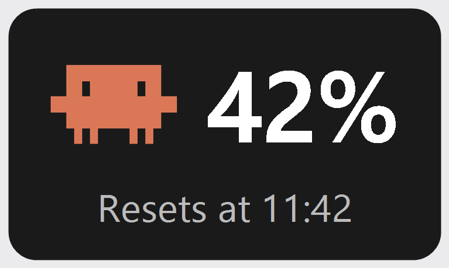

# Claude Usage Widget

A small, always-on-top Windows desktop widget that shows your current
Claude.ai session usage and reset time at a glance.



## Features

- Frameless, draggable, always-on-top widget showing usage % and reset time
- Shows the weekly limit as well as the current session, and turns amber then red as
  the weekly limit runs out — the session figure alone can look fine while the weekly
  limit is what is actually blocking you
- Draws a red slash across the whole widget when either limit hits 100%, i.e. when the
  account can't be used at all until it resets
- Refreshes automatically on a configurable interval (default: every 60 seconds)
- Right-click menu: Log in / show browser, Refresh now, Settings, Exit
- Session/cookies persisted in a dedicated WebView2 profile, so you only log in once
- Named profiles, so you can run several widgets side by side on different Claude accounts,
  each with its own accent colour
- Remembers its window position between runs

## How it works

The widget keeps a hidden WebView2 instance pointed at your configured
claude.ai usage page, periodically re-navigates it, and reads the rendered
page for the usage percentages and "Resets ..." text. The page lists the
current session first and the weekly limit second, and words each reset either
as a countdown ("Resets in 50 min") or as an absolute time ("Resets at 8:50 PM",
"Resets Saturday 8:00 AM") depending on the account type. The widget resolves
all of those to an actual moment, then shows the session reset as a clock time
("Resets at 17:30") and the weekly reset as a countdown ("resets in 6 days,
15 hr"), which is easier to read for something that far out. No API keys are
used and nothing is scraped from network traffic — it's the same page you'd
see in a normal browser tab.

## Requirements

- Windows 10/11
- [.NET 10 SDK](https://dotnet.microsoft.com/) (to build)
- Microsoft Edge WebView2 Runtime (already installed on most modern Windows systems)

## Build & run

```
dotnet build ClaudeUsageWidget.csproj -c Release
bin\Release\net10.0-windows\ClaudeUsageWidget.exe
```

Or open `ClaudeUsageWidget.slnx` in Visual Studio and press F5.

## First-time setup

On first run the widget shows `?` until you're logged in. Right-click it →
**Log in / show browser**, sign in to Claude in the window that appears,
then click **Done**. Your session is cached locally, so you shouldn't need
to log in again.

## Multiple accounts

Each widget instance runs under a *profile*, which owns its own settings file
and its own browser session — and therefore its own claude.ai login. Pass
`--profile <name>` to pick one:

```
bin\Release\net10.0-windows\ClaudeUsageWidget.exe --profile work
bin\Release\net10.0-windows\ClaudeUsageWidget.exe --profile personal
```

Or just run `run-two-profiles.cmd`, which starts both.

Log in to each one separately (right-click → **Log in / show browser**).

Each named profile is colour-coded so you can tell the widgets apart at a
glance: an accent stripe down its left edge, plus a faint tint of the same
colour through the widget's translucent background. The colour is derived from
the profile name, so a given name always gets the same one; pick it explicitly
in **Settings → Accent colour** if you'd rather choose.

The profile name itself stays off the widget to keep it compact — hover for
the tooltip, or open **Settings...**, which is titled with the profile name.
Each profile also opens at a different default spot on screen, and remembers
its own position, URL, and refresh rate.

Running with no `--profile` uses the profile named `default`, whose data stays
where it always was — so an existing install keeps its settings and session.

Notes:

- Two instances **must** use different profiles. WebView2 locks its user-data
  folder to a single process, so a second widget on the same profile won't load
  the page.
- **Launch at Windows startup** is per profile, so you can have both start with
  Windows (tick the box in each one's settings).

## Settings

Right-click → **Settings...** lets you change:

- **Page URL** — which claude.ai page to read from (defaults to `https://claude.ai/settings/usage`)
- **Refresh rate (seconds)** — how often to refresh (default: 60)
- **Accent colour** — the widget's colour coding (default: automatic, derived from the profile name)
- **Launch at Windows startup** — adds/removes the app from your per-user startup entries (default: off)

Settings and the WebView2 session data are stored under
`%AppData%\ClaudeUsageWidget\`, outside the repo — at the top level for the
`default` profile, and under `Profiles\<name>\` for a named one.

## Privacy

The widget doesn't send your data anywhere — it only talks to claude.ai
through a browser instance embedded in the app. No credentials, tokens, or
usage data leave your machine or get logged.

## License

[MIT](LICENSE)
